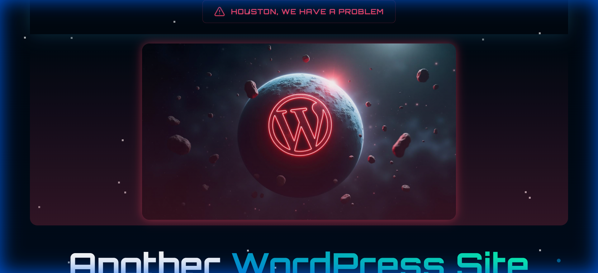

# React Rescue Odyssey

A story-driven space rescue website template with interactive narratives and Supabase backend.

[](./LICENSE)
[](https://react.dev)
[](https://supabase.com)
[](https://vitejs.dev)
[](https://tailwindcss.com)
[](https://www.typescriptlang.org)
[](https://www.radix-ui.com)



> **[Live Demo →](https://react-rescue-odyssey-wpagencys-projects.vercel.app)**

## Features

- **Story-driven interactive narrative** - Immersive space rescue storyline with branching narratives
- **Supabase backend with PostgreSQL** - Powerful, open-source Firebase alternative
- **Real-time database capabilities** - Live updates and real-time collaboration features
- **Space rescue themed components** - Custom-designed components with cosmic aesthetic
- **Interactive storytelling sections** - Engaging narrative components with user choices
- **20+ Radix UI accessible components** - WCAG 2.1 compliant, unstyled primitives
- **shadcn/ui design system** - Modern, copy-paste component library built on Radix UI
- **React Hook Form + Zod validation** - Performant, flexible form validation with TypeScript
- **TanStack Query data fetching** - Advanced server state management and caching
- **Edge functions support** - Serverless functions for custom logic and integrations

## Quick Start

```bash
# Clone the repository
git clone https://github.com/wpagency/react-rescue-odyssey.git

# Navigate to the project
cd react-rescue-odyssey

# Install dependencies
npm install

# Start development server
npm run dev
```

Open [http://localhost:5173](http://localhost:5173) in your browser.

## Tech Stack

| Technology | Purpose |
|-----------|---------|
| React 18.3.1 | UI framework with hooks and concurrent features |
| Supabase 2.52.0 | Open-source Firebase alternative with PostgreSQL |
| Vite 5.4.1 | Next-generation frontend build tool |
| Tailwind CSS 3.4.11 | Utility-first CSS framework |
| React Router v6 | Client-side routing for single-page application |
| TanStack Query 5.56.2 | Advanced server state management and caching |
| React Hook Form 7.x | Performant, flexible form library |
| Zod | TypeScript-first schema validation |
| TypeScript 5.5.3 | Typed superset of JavaScript |
| Radix UI | Accessible, unstyled component primitives |
| shadcn/ui | High-quality React components |

## Project Structure

```
react-rescue-odyssey/
├── src/
│   ├── components/        # UI components and layouts
│   ├── pages/             # Route pages (narrative scenes, missions, etc.)
│   ├── hooks/             # Custom React hooks for data fetching
│   ├── lib/               # Utility functions and helpers
│   ├── types/             # TypeScript definitions
│   ├── services/          # Supabase client and API calls
│   └── App.tsx            # Main application component
├── public/                # Static assets and screenshots
├── index.html             # HTML entry point
├── vite.config.ts         # Vite configuration
├── tailwind.config.ts     # Tailwind CSS theme config
└── tsconfig.json          # TypeScript configuration
```

## Environment Variables

Copy `.env.example` to `.env.local` and fill in your Supabase credentials:

```bash
cp .env.example .env.local
```

See [.env.example](./.env.example) for all available options.

Required environment variables:
- `VITE_SUPABASE_URL` - Your Supabase project URL
- `VITE_SUPABASE_ANON_KEY` - Your Supabase anonymous key

## Scripts

| Command | Description |
|---------|------------|
| `npm run dev` | Start development server with hot reload |
| `npm run build` | Build for production with optimizations |
| `npm run preview` | Preview production build locally |
| `npm run lint` | Run ESLint to check code quality |
| `npm run type-check` | Check TypeScript types |

## Customization

### Colors and Theme

Edit the cosmic color palette in `tailwind.config.ts` or `src/index.css` while maintaining the space rescue aesthetic. The theme uses space-themed fonts and color variations.

### Narrative Storyline

Customize the interactive story in the narrative components and page sections. Update mission objectives, dialogue, and branching paths:

```tsx
export function NarrativeScene() {
  const [missionState, setMissionState] = useState('briefing');

  return (
    <section>
      {missionState === 'briefing' && <MissionBriefing />}
      {missionState === 'rescue' && <RescueSequence />}
      {missionState === 'outcome' && <MissionOutcome />}
    </section>
  );
}
```

### Supabase Integration

Set up tables and auth in your Supabase project. Use the provided services to fetch and manage data:

```tsx
import { supabase } from '@/services/supabase';

export async function getMissions() {
  const { data, error } = await supabase
    .from('missions')
    .select('*')
    .order('created_at', { ascending: false });

  return data;
}
```

### Database Schema

Create the following tables in your Supabase project:
- `missions` - Mission data and objectives
- `characters` - Character profiles and backstories
- `achievements` - User progress and achievements
- `user_profiles` - Extended user information

## Other Themes in This Collection

| Theme | Description | Demo |
|-------|------------|------|
| [Astro Brutalfolio](https://github.com/wpagency/astro-brutalfolio) | Brutalist multilingual portfolio | [Demo](https://astro-brutalfolio-wpagencys-projects.vercel.app) |
| [Astro Romance](https://github.com/wpagency/astro-romance) | Romantic pink agency theme | [Demo](https://astro-romance-wpagencys-projects.vercel.app) |
| [Astro Starter](https://github.com/wpagency/astro-starter) | Full-featured Astro starter with Three.js | [Demo](https://astro-starter-wpagencys-projects.vercel.app) |
| [React Agency Genesis](https://github.com/wpagency/react-agency-genesis) | Premium agency funnel template | [Demo](https://react-agency-genesis-wpagencys-projects.vercel.app) |
| [React Parallax Foundry](https://github.com/wpagency/react-parallax-foundry) | 3D parallax website with R3F | [Demo](https://react-parallax-foundry-wpagencys-projects.vercel.app) |
| [React Pulse Robot](https://github.com/wpagency/react-pulse-robot) | WordPress showcase with Lottie | [Demo](https://react-pulse-robot-wpagencys-projects.vercel.app) |
| [React Source Seeker](https://github.com/wpagency/react-source-seeker) | Interactive 3D storytelling with PWA | [Demo](https://react-source-seeker-wpagencys-projects.vercel.app) |

## Contributing

Contributions are welcome! Please see [CONTRIBUTING.md](./CONTRIBUTING.md) for guidelines.

## License

MIT License — see [LICENSE](./LICENSE) for details.

---

### Built by [WP Agency](https://wpagency.xyz) — WordPress and Beyond

With 15+ years of agency experience, we build production websites that perform. These open-source themes represent our commitment to the developer community.

**Need customization or a production build?** [Let's talk →](https://wpagency.xyz/contact)
